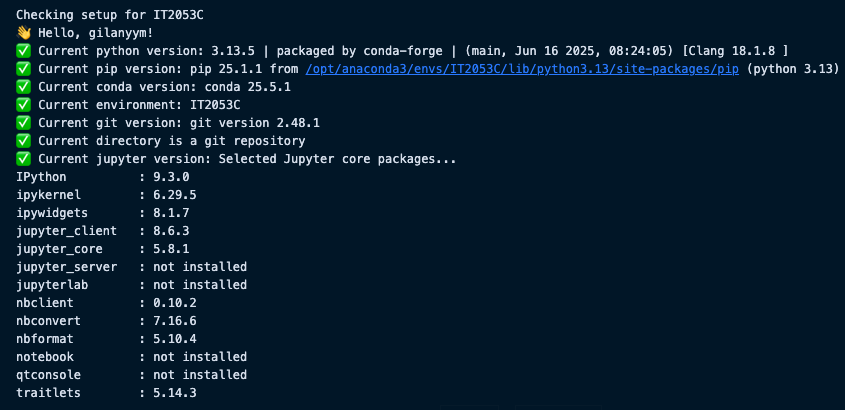

# IT2053C Assignment Environment Setup

This repository contains the environment configuration for IT2053C assignments.

## Prerequisites

Before setting up this environment, ensure you have the following installed:

### Required Software

1. **Anaconda or Miniconda**
   - Download from: https://www.anaconda.com/download or https://docs.conda.io/en/latest/miniconda.html
   - Conda version: 23.0.0 or later recommended (latest stable version preferred)
   - Verify installation: `conda --version`

2. **Python**
   - Version: 3.8 or later
   - Usually included with Anaconda/Miniconda
   - Verify installation: `python --version`

3. **Visual Studio Code** (for notebook usage)
   - Download from: https://code.visualstudio.com/
   - Install the "Jupyter" extension from the Extensions marketplace
   - Verify installation: Open VSCode and check Extensions

### System Requirements

- **Operating System**: Windows 10+, macOS 10.14+, or Linux
- **RAM**: Minimum 4GB, 8GB+ recommended
- **Disk Space**: At least 2GB free space for the environment
- **Internet Connection**: Required for downloading packages

### Optional (for Windows users)

- **Git for Windows**: Provides Git Bash terminal for running `.sh` scripts
- **WSL**: Windows Subsystem for Linux for full Linux environment

## IT2053C Environment Setup Methods

To setup the environment, you can use one of the following methods:

1. Cross-platform Python script (Recommended)
2. Platform-specific scripts
3. Manual setup

### Option 1: Cross-platform Python script (Recommended)
```bash
# You must provide your 6+2 username
python scripts/setup.py --username <your_6+2_username>

# Example:
python scripts/setup.py --username gilanyym
```

### Option 2: Platform-specific scripts

**On Windows:**
```cmd
# Command Prompt or PowerShell
scripts\setup.bat <your_6+2_username>

# Git Bash, WSL, or Cygwin
./scripts/setup.sh <your_6+2_username>
```

**On macOS/Linux:**
```bash
./scripts/setup.sh <your_6+2_username>
```

**Examples:**
```bash
# macOS/Linux
./scripts/setup.sh gilanyym

# Windows Command Prompt
scripts\setup.bat gilanyym
```

### Option 3: Manual setup
```bash
# Direct conda command
conda env create -f environment.yml

# Set STUDENT_USERNAME variable manually (after creating the environment)
conda env config vars set STUDENT_USERNAME=<your_6+2_username> -n IT2053C
```

## To use the environment

Usually, we'll be using the created environment in the Jupyter Notebook. But if you want to use the environment in the terminal, you can do the following:

### Activate the environment
```bash
conda activate IT2053C
```

### Deactivate the environment
```bash
conda deactivate
```

### Update the environment
```bash
conda env update -f environment.yml
```

## Verification

After setting up the environment, you can verify everything is working correctly using either method:

### Option 1: Jupyter Notebook in VSCode (Recommended for beginners)
1. **Open VSCode** and install the Jupyter extension if not already installed
2. **Open the project folder** in VSCode
3. **Open the verification notebook**:
   - Open `setup-checker.ipynb` in VSCode
   - **Important**: Select the correct kernel "IT2053C (Python 3)" from the kernel picker in the top-right
   - Run all cells to verify your setup

### Option 2: Python Script (For advanced users)
1. **Activate the environment**:
   ```bash
   conda activate IT2053C
   ```
2. **Run the verification script**:
   ```bash
   python setup-checker.py
   ```

### Expected Results
Both methods should show an output like this:


## Environment Details

- **Python**: 3.13.5
- **JupyterLab**: 4.4.4
- **Key packages**: pandas, numpy, matplotlib, seaborn, scikit-learn, plotly, ipywidgets

## Troubleshooting

### JupyterLab Extension Warnings
If you see warnings about deprecated `jupyter labextension install` commands:
- These are normal for JupyterLab 4.x
- Extensions are now managed through the Extension Manager in the UI
- Widgets are already included in the environment

### Conda Deprecation Warnings
If you see warnings like:
```
FutureWarning: `remote_definition` is deprecated and will be removed in 25.9
```
- This is a **deprecation warning**, not an error
- Your environment setup will still work correctly
- The warning appears in newer conda versions (24.x/25.x)
- You can safely ignore this warning
- The environment update will complete successfully

### Environment Activation
- The environment will NOT auto-activate
- You must manually activate it with `conda activate IT2053C`
- This prevents conflicts with other projects

### Username Requirement
- All setup scripts require your 6+2 username as an argument
- **Python script**: `python scripts/setup.py --username <your_username>`
- **Shell script**: `./scripts/setup.sh <your_username>`
- **Batch script**: `scripts\setup.bat <your_username>`
- The 6+2 username is the university's naming convention, but any length is accepted
- If you get an error about the username, make sure you're providing it correctly

### Windows Users
- **Command Prompt/PowerShell**: Use `scripts\setup.bat <username>` or `python scripts/setup.py --username <username>`
- **Git Bash**: Use `./scripts/setup.sh <username>` or `python scripts/setup.py --username <username>`
- **WSL**: Use `./scripts/setup.sh <username>` or `python scripts/setup.py --username <username>`

### Jupyter Kernel Issues
If the notebook shows errors or wrong Python version:
- **Check kernel selection**: In VSCode, look at the top-right corner of the notebook
- **Select correct kernel**: Click on the kernel name and choose "IT2053C (Python 3)"
- **Restart kernel**: If needed, use the restart button in the notebook toolbar
- **Verify environment**: The kernel should show "IT2053C" in the kernel list
- **Install Jupyter extension**: If notebooks don't work, install the "Jupyter" extension in VSCode

## Files

- `environment.yml` - Conda environment specification
- `scripts/setup.py` - Cross-platform setup script (works everywhere)
- `scripts/setup.sh` - Unix/macOS/Git Bash setup script
- `scripts/setup.bat` - Windows Command Prompt/PowerShell setup script
- `setup-checker.ipynb` - Jupyter notebook for verification
- `setup-checker.py` - Environment verification script

## Requirements

- Anaconda or Miniconda installed
- Python 3.8+ (for setup scripts)
